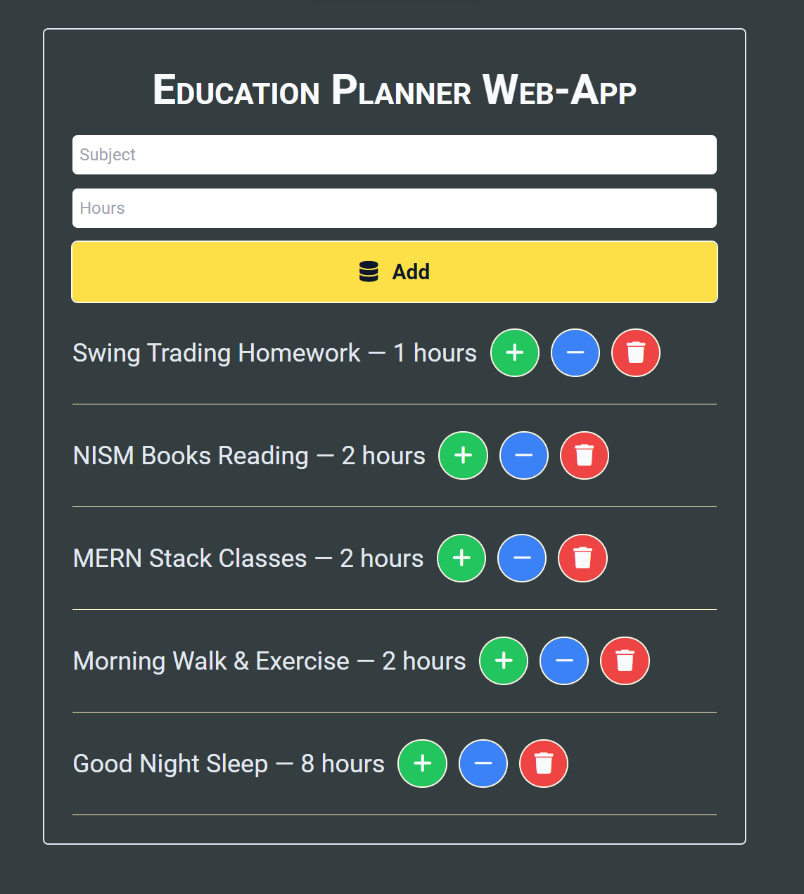

# Module#5 React Day 5 Classwork - Education Planner WebApp


## Hosted Version of the Project:
[m5react-day-5-classwork-education-planner-webapp](https://m5react-day-5-classwork-education-planner-webapp.vercel.app/)

## Objective
I have Developed a user-friendly Education Planner web application using ReactJS that
Enables users to add subject names and allocate study hours to create personalized study schedules. i have Implemented local storage for data persistence and Provided the functionality to adjust subject hours using plus and minus buttons, powered by React's useState hook.


## How to install and run in yours local machine
```bash
npm install
npm run start
```

## Tech. Stack Used:
+ [React](https://react.dev/)
+ [Google Fonts](https://fonts.google.com/)
+ [Font Awesome](https://fontawesome.com/icons/)

## Author
[Abhishek kumar](https://www.linkedin.com/in/alex21c/), ([Geekster](https://geekster.in/) MERN Stack FS-14 Batch)


